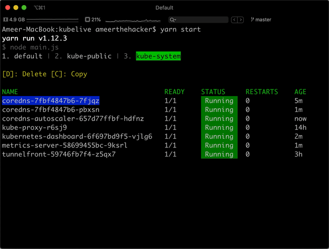

<h1 align="center">:sparkles: Kubelive</h1>

  Kubernetes command line tool to provide live data about the cluster and it's resources

  

:rotating_light: This repo is in active development

Show your support by :star: the repo

## License

MIT © [Ameer Jhan](mailto:ameerjhanprof@gmail.com)
